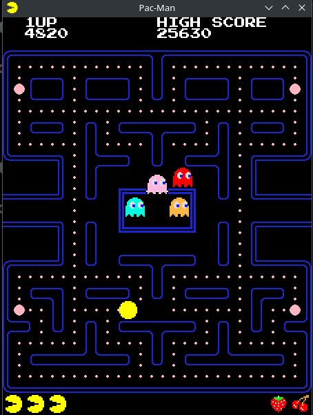

Pac-Man in Python
===

This code was initially written to follow the excellent tutorial at
[pacmancode.com](https://pacmancode.com) on how to create a Pac-Man
game in Python. Since then it's been enhanced to make the game more
faithful to the arcade original. See [CREDITS.md](CREDITS.md) for a
complete list of credits.

Setup
---

	make install

Run
---

	make run

Debug
---

	make debug
	
Improvements
---
I've made the following improvements to the code posted on
[pacmancode.com](https://pacmancode.com), using information I found in
the excellent [Pac-Man Dossier](https://pacman.holenet.info) by Jamey
Pittman (P.S. Go check out his [perfect Pac-Man game on
YouTube](https://www.youtube.com/watch?v=AuoH0vz3Mqk))

- Pac-Man gains an extra life on reaching 10,000 pts
- Correct fruit sprites & values
- Fruit of last 6 rounds is now displayed
- High score is saved & restored from disk
- Varying Pac-Man & ghost speeds by game level
- Varying ghost fright times by game level
- Ghosts now reverse direction when frightened
- Pac-Man speeds up in fright mode
- Ghosts slow down in the portal
- Ghosts flash a few seconds before leaving fright mode
- Pac-Man can do "pre-turns" (aka "cornering")
- Added support for gamepads & joysticks
- Increased the game speed to match MAME as closely as possible
- Blinky becomes faster "Elroy 1" & "Elroy 2" as pellets are depleted
- Inky & Clyde get released from the ghost pen on a timer instead of
  when Pac-Man has eaten 30/70 pellets
- The spritesheet has been replaced with one that looks better and
  includes ghost animation frames
- The ghosts are animated while moving.
- Added most sounds

Please enjoy!
